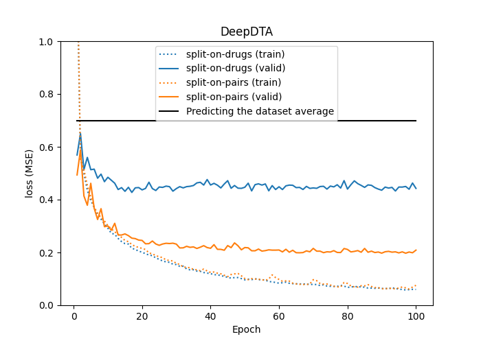

# BindingAffinity
Exploring deep learning for predicting the binding affinity between a small molecule (i.e. a drug) and a protein. The models are fitted on the [Kiba dataset](https://pubs.acs.org/doi/10.1021/ci400709d).

## Introduction

### Performance evaluation

#### Data partitioning
The [Kiba dataset](https://pubs.acs.org/doi/10.1021/ci400709d) is made up of drug-protein pairs labelled with an experimentally measured binding affinity (numerical). The Kiba dataset has 2 068 unique drugs, 229 proteins and 98 545 drug-protein pairs. Thus, each drug (and protein) occurs in multiple different pairs. This suggests three different ways of partitioning the data. 

 1) Split on pairs, where each pair is considered unique, and the data is split by pairs (this is done in [DeepDTA](https://arxiv.org/abs/1801.10193) and [BERT-GCN](https://openreview.net/pdf?id=Zqf6RGp5lqf)). This results in the same drugs (and proteins) occurring in both partitions. 
 2) Split on drugs, where the data is split on the unique drugs so that only proteins occur in both partitions, not drugs. 
 3) Split on proteins, where the data is split on the unique proteins so that only drugs occur in both partitions, not drugs. Splitting on unique drugs and proteins is not feasible since it requires excluding all pairs made up of a drug from one partition and a protein from the other (thus losing a lot of data).

What strategy to use depends on how the model is intended to be used. When using strategy 1) the performance is only relevant to drugs and proteins already present in the training set. This seems unrealistic for practical applications. For example, when predicting the binding affinity of a NEW drug. With strategy 2) (or 3)), the performance is relevant to situations where the drug (or protein) was not present in the training set, but the protein (or drug) was. This seems more realistic.

The performance depends strongly on the chosen method. See, for example, the difference between [DeepDTA models](https://arxiv.org/abs/1801.10193) fitted and evaluated on data split by strategies 1) and 2).



## Install
```termial
pip install -r requirements.txt
```

## Data
In the working directory, make the directory `data,` and then the subdirectories `raw` and `processed` in `data`.
```terminal
mkdir -p data/raw
mkdir -p data/processed
```

### Models

#### DeepDTA
The DeepDTA model is presented in [DeepDTA: Deep Drug-Target Binding Affinity Prediction](https://arxiv.org/abs/1801.10193). The original code is available [here](https://github.com/hkmztrk/DeepDTA).

#### Train and evaluate
```terminal
python train_deepDTA.py
```
#### Hybrid -- Graph-Embeddings
The Hybrid model combines a GCN-branch for drug encoding and an embedding (DeepDTA-style) branch for protein encoding. In the drug branch, the drugs [SMILES](https://en.wikipedia.org/wiki/Simplified_molecular-input_line-entry_system) are first represented as graphs (nodes and edges) followed by three layers of graph convolutions. These are combined with protein encodings in a common regression head. Original code [here](https://github.com/kalleknast/BindingAffinity).

#### Train and evaluate
```terminal
python train_Hybrid.py
```

#### BERT-CNN
BERT embeddings and 1D convolutional branches as in DeepDTA. Original code [here](https://github.com/kalleknast/BindingAffinity). 

#### Train and evaluate
```terminal
python train_BertDTA.py
```

#### MT-DTI
The model has roughly the same architecture as [DeepDTA](https://github.com/hkmztrk/DeepDTA) but differs in that a pre-trained BERT encoder encodes the drug SMILES.

The original TenforFlow implementation is available [here](https://github.com/deargen/mt-dti). The implementation here differs in that it relies on a pre-trained drug encoder from [DeepChem/ChemBERTa-77M-MTR](https://huggingface.co/DeepChem) that, after initial MLM pre-training, it has been fine-tuned with [Multi Task Regression](https://arxiv.org/abs/2209.01712). For the current DTI task, most of the drug encoder (ChemBERTa) is frozen, and only the final pooler layer is newly initialized and trained.

In the original [MT-DTI paper](https://arxiv.org/abs/1908.06760) the model was trained for 1000 epochs. However, the training takes a long time on a GPU due to the BERT drug encoder, so I only trained for 100 epochs.

#### Train and evaluate
```terminal
python train_MTDTI.py
```


#### TODO
- [x] Try BERT pre-trained on the 10M PubChem dataset ("seyonec/PubChem10M_SMILES_*" at https://huggingface.co/seyonec).
  - Replaced [ChemBERTa_zinc250k_v2_40k](https://huggingface.co/seyonec/ChemBERTa_zinc250k_v2_40k) with the 77M PubChem MTR model [DeepChem/ChemBERTa-77M-MTR](https://huggingface.co/DeepChem).

#### BERT-GCN
The paper [Modelling Drug-Target Binding Affinity using a BERT based Graph Neural network](https://openreview.net/pdf?id=Zqf6RGp5lqf) by Lennox, Robertson and Devereux presents a graph convolutional neural network (GCN) trained to predict the binding affinity of drugs to proteins. Their model takes as input BERT-embedded protein sequences and drug molecules. This combination of BERT embeddings and a graph network is relatively novel, and the model achieves (at publication) state-of-the-art results. However, the paper leaves many technical details unspecified, and no code is provided. Thus, the goal is the implement the GCN and replicate the results from the paper.

##### Issues and solutions

###### Data
A GCN takes nodes and edges as inputs. The paper describes embedding both proteins and drugs using pre-trained BERT models where each token is embedded as a 768-long vector. This results in two issues that are not mentioned in the paper.
####### Proteins
The primary protein sequence is tokenized into amino acids and there are trivial edges between neighbouring tokens. However, a protein's 3D structure puts some amino acids very close to each other and edges between those should also be included. The authors do not mention anything about this. Here, only edges to neighbours in the primary sequence are included.
####### Drugs
The drugs are tokenized with a Byte-Pair Encoder (BPE) from Simplified molecular-input line-entry system [SMILES](https://en.wikipedia.org/wiki/Simplified_molecular-input_line-entry_system). A BPE combines characters to produce a fixed-size vocabulary where frequently occurring subsequences of characters are combined into tokens. The particular BPE (probably) used in the paper separates bond tokens and atom tokens so that multi-character tokens are made of either only atoms (nodes) or only bonds. An embedded SMILES will be made up of both node (atoms) and bond vectors. Since the bonds often correspond to small groups of atoms, the edges computed directly from a SMILES string do not match (the latter edges are between atoms). The paper does not specify how this was resolved. Here, only edges between nodes were included, and embedding vectors corresponding to bonds were removed (i.e. only node vectors were included as inputs to the GCN).

###### Network architecture
The network architecture is described in Fig. 1 of the paper.
 1. **Issue**: In step 1, there is an average pooling layer after embedding (both protein and drug). This layer collapses the tensors over the nodes and is generally used as a readout layer right before the classification/regression head. The purpose of the average pooling layer before the GCN layers is unclear. **Solution**: This average pooling layer was omitted.
 2. **Issue**:In step 4, there is a concatenation layer directly after the GCN layers. What is being concatenated is unclear. **Solution**: This concatenation layer was omitted.
 3. **Issue**: In step 3, there is no readout layer that collapses over nodes. Thus, the input to the final dense layers will have a variable number of nodes. This does not work. **Solution**: After the GCN layers, an average pooling layer was added.
 

#### Train and evaluate
This will download and process the data the first time it runs.
```terminal
python train_BertGCN.py
```


 

## TODO
 - [ ] See if the actual `edge_index` for the proteins can be downloaded from the [UniProt](https://www.uniprot.org/) protein database.
 - [ ] Add residual connections to the GCN layers.

